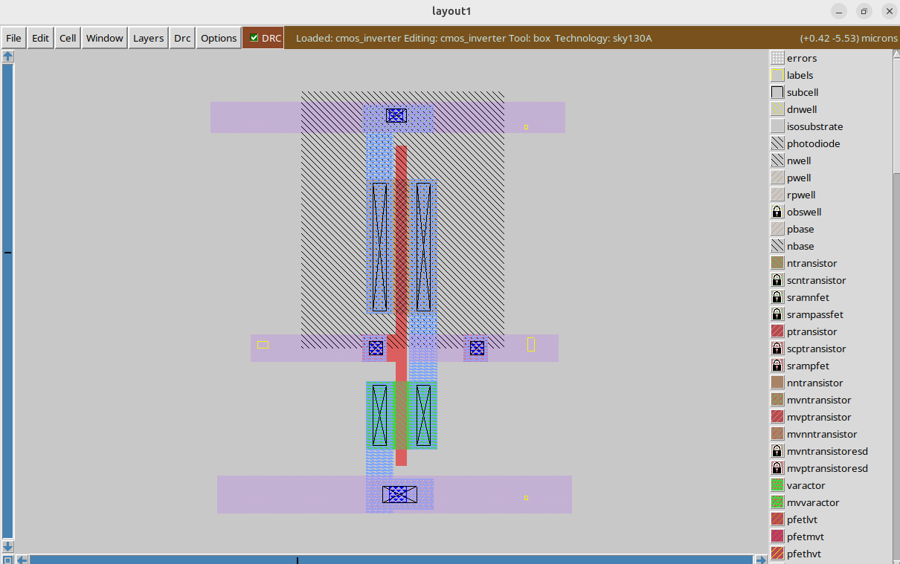

# CMOS Inverter Layout Design

This folder contains the layout design of a CMOS inverter along with simulation-related files.

---

## 1. Layout Overview

The layout was designed in **Magic** using the **Sky130 PDK**. The design includes both **PMOS** and **NMOS** transistors and their interconnections.

### Screenshot of Layout
  
The above image shows the finalized layout of the CMOS inverter, including diffusion regions, polysilicon gates, and metal connections.

---

## 2. Files Included

| File Name | Description |
|-----------|-------------|
| `cmos_inverter.mag` | Magic layout file. Open in Magic to view/edit the layout. |
| `cmos_inverter.ext` | Extracted layout file with parasitics. Can be used for post-layout simulation. |
| `cmos_inverter.spice` | SPICE netlist for post-layout simulation. Includes extracted parasitic capacitances. |
| `layout_screenshot.png` | Screenshot of the CMOS inverter layout for quick reference. |

---

## 3. Post-Layout Simulation

The `.ext` file was used to extract parasitics and generate the `.spice` netlist. Post-layout simulation was performed to validate:  

- Voltage Transfer Characteristic (VTC)  
- Noise Margin  
- Propagation Delay  
- Power Consumption  

You can run the SPICE simulation using **ngspice**:

```bash
ngspice cmos_inverter.spice

