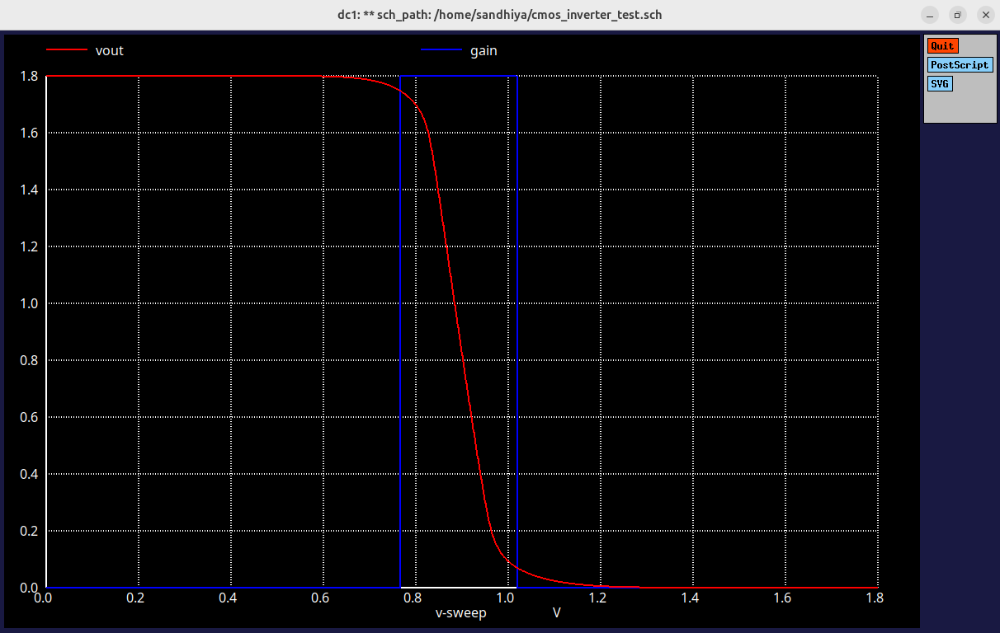
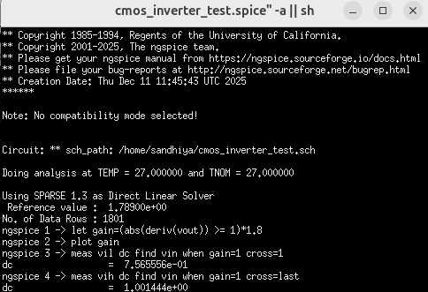
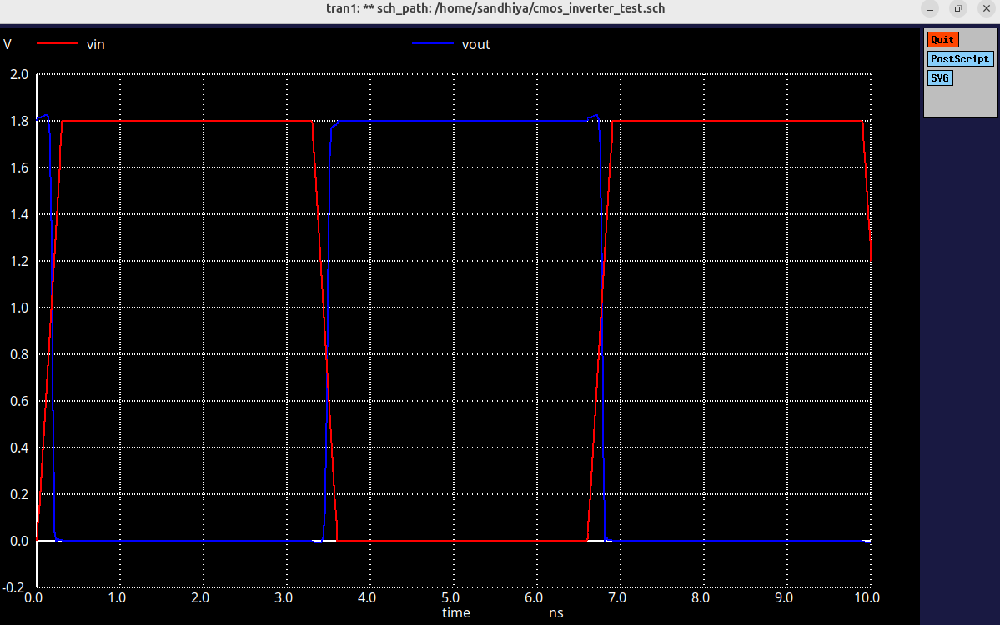
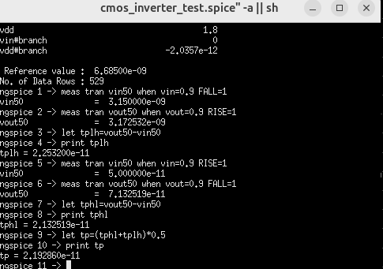
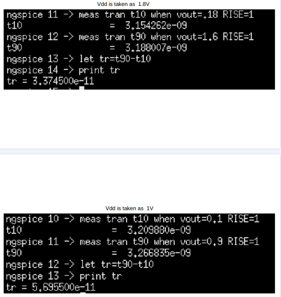
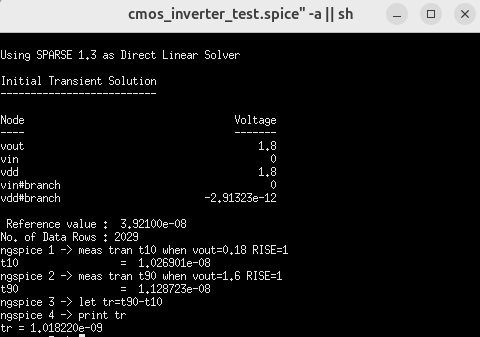
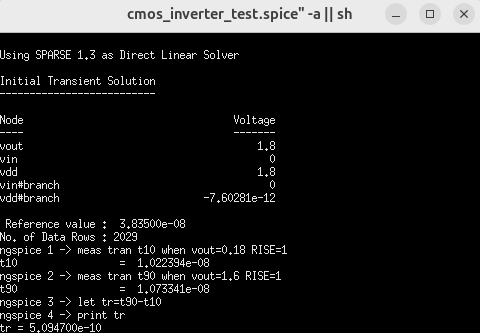
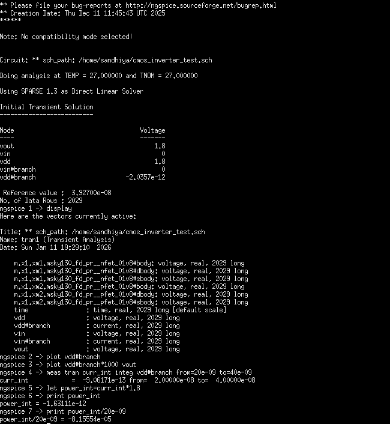

# Pre-Layout Simulation

This repository contains the **pre-layout simulation results** of a CMOS inverter designed using the **SKY130 Open PDK**. All simulations were performed at the schematic level using **xschem** with **ngspice** as the simulation backend.

---

## Simulations Performed

### 1. DC Analysis (Voltage Transfer Characteristics)
- A DC sweep of the input voltage was performed to obtain the **Voltage Transfer Characteristics (VTC)** of the CMOS inverter.
- From the VTC curve, the following parameters were extracted:
  - \( V_{IL} \), \( V_{IH} \)
  - \( V_{OL} \), \( V_{OH} \)
  - **Noise Margins**: \( NM_L \) and \( NM_H \)

This analysis verifies the static behavior and noise immunity of the inverter.

---

### 2. Transient Analysis
- Transient simulation was performed by applying a pulse input to the inverter.
- The following dynamic parameters were evaluated:
  - Propagation delay (\( t_{PLH} \) and \( t_{PHL} \))
  - Average propagation delay
  - Power consumption

This analysis validates the switching performance and dynamic behavior of the CMOS inverter.

## Delay Optimization Techniques
To improve the switching speed of the inverter, the following methods were explored:

1. **Increasing \( V_{DD} \)**  
   - Raising the supply voltage increases the drive current of MOSFETs, reducing propagation delay.  
   - Observed reduction in \( t_{PLH} \) and \( t_{PHL} \), but slightly higher dynamic power.

2. **Reducing Capacitance Loading**  
   - Minimizing the load capacitance at the output node reduces the time constant, speeding up transitions.  
   - Delay improved significantly for lower capacitance scenarios.

3. **Increasing MOSFET Sizing**  
   - Increasing the width of NMOS and PMOS transistors enhances the drive current, which can lower propagation delay.  
   - **Important:** This technique is effective only when there is significant external capacitive loading at the output. Without a load capacitance, simply increasing transistor size does not noticeably reduce delay.  
   - Trade-off: Larger devices consume more area and slightly more power.

---

---

## Simulation Results

### 1. DC Analysis

#### 1.1 Voltage Transfer Characteristic (VTC)
  
VTC showing output voltage (Vout) versus input voltage (Vin) for the CMOS inverter.

#### 1.2 VTC with High Gain Region
  
Blue markers indicate the region of maximum gain (steepest slope) of the VTC.

#### 1.3 Noise Margin
  
Noise margin is derived from VIL and VIH points on the VTC.

---

### 2. Transient Analysis

#### 2.1 Transient Response
  
Input and output waveforms of the inverter showing switching behavior.

#### 2.2 Propagation Delay
  
Measurement of delay from input transition to output transition (TPHL and TPLH).

#### 2.3 Delay Optimization Techniques

- **Increasing VDD to Reduce Delay**  
  

- **Reducing Load Capacitance to Reduce Delay**  
  

- **Transistor Sizing to Reduce Delay**  
  

---

### 3. Power Analysis
  
Estimation of dynamic and static power consumption of the CMOS inverter.

---

